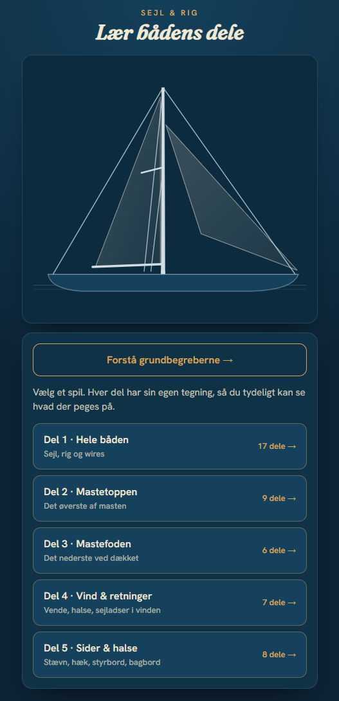

# Sejl-quiz ⚓

En lille dansk quiz, der lærer dig sejlbådens dele, rig og vindretninger. Hver del har sin egen tegning, så du tydeligt kan se hvad der peges på.

**👉 Prøv den live: [sejl-quiz.unqhosting.com](https://sejl-quiz.unqhosting.com)**

Bygget som en statisk single-page app med [Vite](https://vite.dev/) og React.

<p align="center">
  
</p>

## Kør lokalt

```bash
npm install
npm run dev
```

## Byg statiske filer

```bash
npm run build      # skriver til dist/
npm run preview    # se det byggede resultat lokalt
```

## Kilde

Delvist baseret på [Sejlerhåndbogen — Sejl- og riggens betegnelser](https://sejlerhaandbogen.dk/sejl-og-riggens-betegnelser/).

